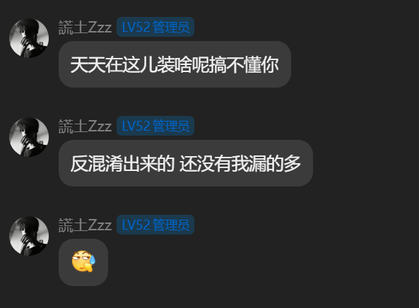
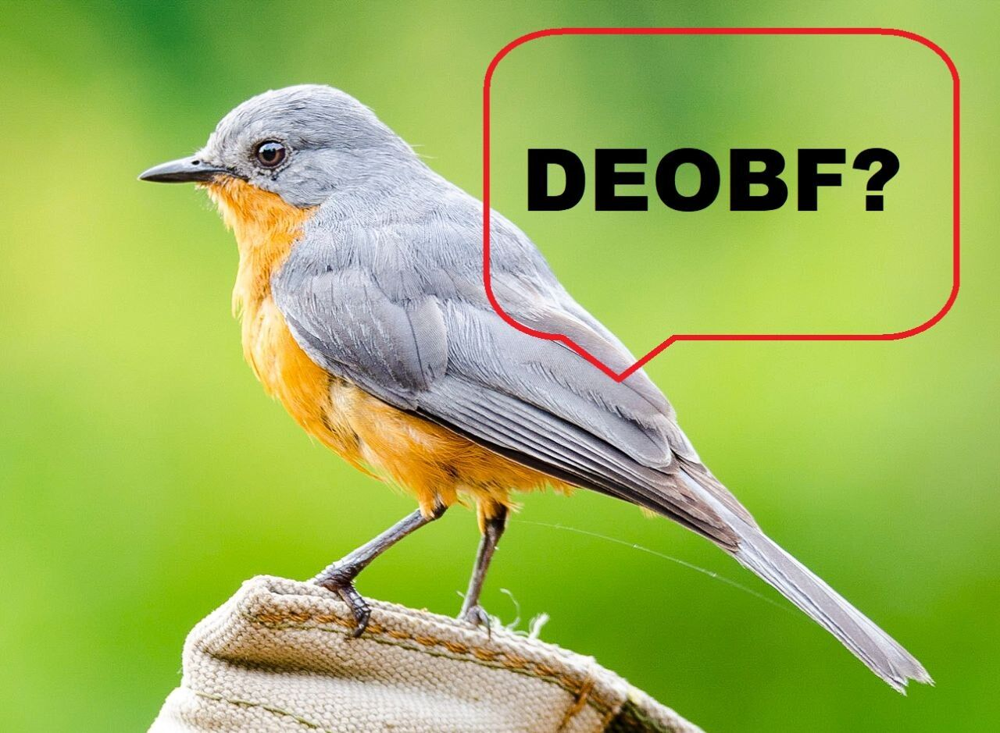
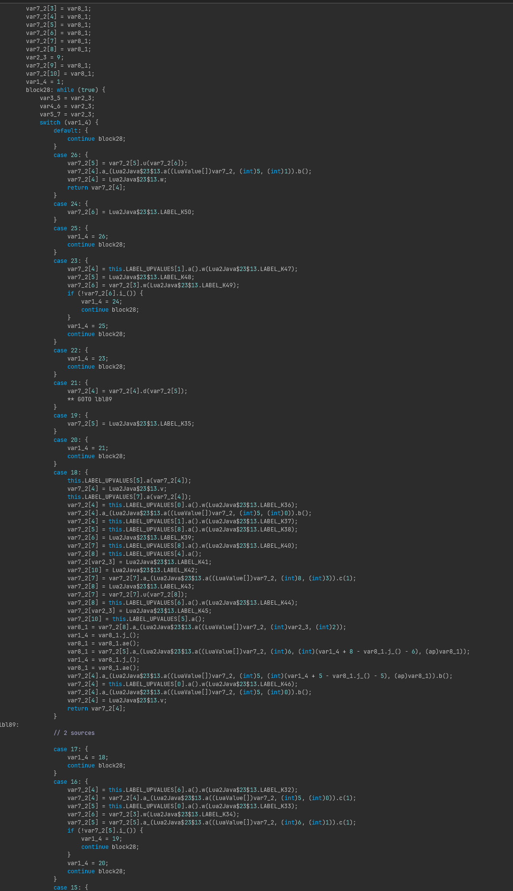
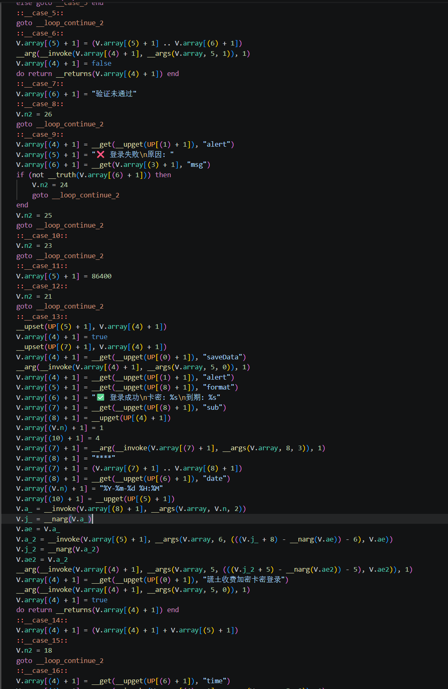
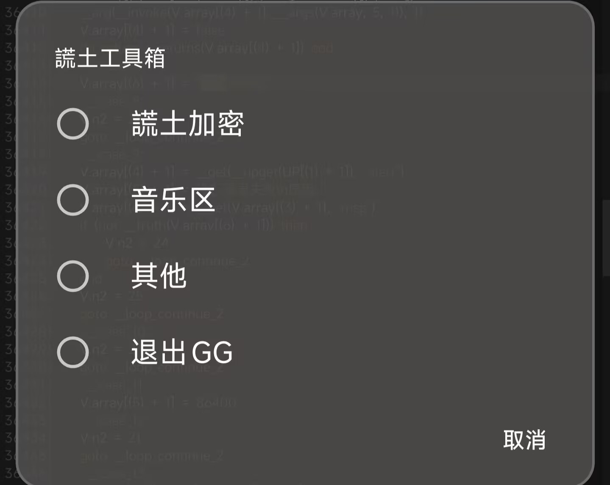

<div align="center">
  <h1>Open謊土加密</h1>
  <p><strong>还原謊土工具箱 HY 加载器与云端 GGLua 加密脚本</strong></p>
</div>

<p align="center">
  
  
  
  
</p>

<p align="center">
  
  
  
  
</p>

<p align="center">
  <strong>简体中文</strong>
</p>

QQ群：`745033528`  
Telegram：`gglua8`

## 项目简介

Open謊土加密是对 **謊土工具箱 5.19** 的完整解混淆与机械还原项目。需要先说明项目边界：APK 中的 `HY` 类主要负责向云端请求、下载并加载脚本，真正的加密本体位于云端返回的 GGLua 脚本中。该项目使用了 **Lua 转 DEX** 技术，将 Lua/GGLua 脚本编译或转换为 DEX 中的 Java 类，再由加载器在运行时执行。我们分析的是这一加载链路及其对应的 LuaJ 编译产物，而不是把 `HY` 类本身误称为加密算法。

从 DEX 中提取相关 `Lua2Java*.class` 后，我们沿着“Lua -> DEX -> Java 状态机 -> Lua”的逆向方向，将由 **GGLua / LuaJ** 编译而来的 Java 状态机重新转换为可读 Lua：共还原 396 个类，类集合完全一致；恢复 324 个函数闭包和 8,524 个常量；核验 2,578 个控制流跳转；Java/Lua 差分结果为 0，根入口事件完全一致。最终得到一份 50,830 行、2,938,793 字节的 Lua 源码。

## 工作对象与执行链路

```text
謊土工具箱 APK
        |
        v
HY 类（请求云端、下载脚本、加载执行）
        |
        v
云端 GGLua 加密脚本（加密本体）
        |
        v
Lua 转 DEX / LuaJ 编译后的 Lua2Java*.class
        |
        v
本项目：反编译、控制流修复、Java -> Lua 机械还原
```

因此，仓库中的 `equivalent.lua` 是对目标云脚本编译产物的还原结果；它可以帮助分析加密流程、运行语义和数据格式，但不代表 APK 中存在一份同名的原始 Lua 文件。

原程序作者为 **謊土**，本次分析样本于 **8 月 28 日** 发布，发布时为公益版本。其曾表示：

> 我会一直走低价这条道路，让各位用上便宜又好用的加密，这是我的初衷。

然后又留下了另一段颇有执行力的发言：

<p align="center">
  
</p>

既然话已经说到这里，我也只好认真落实一下“去开吧”。

在我反混淆后再次留下来了一句震撼发言<p align="center">
  
</p>
很显然对方并不知道什么是lua转dex什么是加密什么是反混淆

## 还原过程

在 **Fable 5**、人工分析和本地脚本工具的配合下，我们对目标云脚本经过 Lua 转 DEX 后生成的 Java 类进行了逐层还原。这里的重点不是给混淆类批量改名，而是把 Lua 编译器生成的状态机重新解释回 Lua 语义：

- 使用 **Procyon**、**CFR** 和 `javap` 交叉检查反编译结果，定位 `Lua2Java*.class` 的真实控制流；
- 使用 **Recaf** 检查类结构、字段、嵌套闭包和常量初始化过程；
- 解析 Lua 转 DEX 生成的 Java AST，恢复 `switch` 状态机、循环、条件分支、显式跳转和闭包调用；
- 还原 LuaJ 的上值引用、Varargs、多返回值、尾调用、表访问和真值判断；
- 从 `LuaString`、`LuaLong`、`decode_B`、`Frag*.S.u` 以及 `byte[]` 初始化代码中恢复字符串和二进制常量；
- 对反编译器产生的标签别名、分支落空、循环层级和负号丢失进行人工修复；
- 使用 Java/Lua 双端 Oracle 对照执行，逐项比较返回值、异常前事件、表操作、上值状态和 GG API 调用。

最终完成了 396 个类、324 个闭包和 8,524 个常量的恢复，处理并核验 2,578 个显式控制流跳转。在 6,414 个差分用例中，Java 与 Lua 的不一致数量为 **0**，根入口两端各产生 99 个事件并完全匹配。


## 还原前后

左侧是 Procyon 从云脚本的 LuaJ 编译产物中吐出的 Java 代码：类型被抹平、方法名被压缩、控制流被拆成大量 `switch`、标签和循环。右侧是机械转换器恢复后的 Lua：闭包、上值、Varargs、多返回值及控制流已经重新落回 Lua 代码。

<p align="center">
  
  
</p>

这份 Lua 仍然保留机械还原代码应有的状态机痕迹，但已经脱离原 APK 和 Java 类，可单独检查并继续人工整理。

## 运行效果

将最终 [`equivalent.lua`](./equivalent.lua) 放入对应的 GameGuardian / GGLua 环境运行。由于原始 `HY` 类还包含云端请求和加载逻辑，脱离原 APK 后需要自行提供等价的脚本输入或运行适配层。实际界面与执行效果如下：

<p align="center">
  
  
</p>

## 工具与方法

本次还原使用或涉及：

- **Procyon**：Java 反编译与结构检查；
- **CFR / javap**：控制流与字节码交叉核对；
- **Recaf**：类文件浏览和人工分析；
- **GGLua / Lua 5.3**：运行语义与语法验证；
- **Lua 转 DEX**：目标项目将 Lua/GGLua 脚本转换为 DEX 类的核心技术链路；
- **Python + javalang**：AST 解析、转换；
- **人工分析**：修复反编译器无法可靠表达的控制流；
- **Fable 5**：辅助修复和整理最终还原的 Lua 源码。

## 注意事项
> “6,414 个用例差分为 0”表示当前构造输入、闭包代理环境及根入口事件全部匹配；它不等于所有真实 GameGuardian 设备、所有网络状态和所有输入文件均已穷举。
> 最终文件含有一套 LuaJ 兼容运行层，因此体积较大。需要继续人工美化时，应以审计报告和差分测试为基线，避免把“看起来更简洁”优化成“运行起来不一样”。

## 关于贡献

欢迎提交 Issues 或 PR，包括但不限于：

- 继续恢复具有明确语义的变量名和函数名；
- 在不破坏差分结果的前提下简化运行层；
- 补充更多 GameGuardian 真机测试；
- 修正文档、运行说明和兼容性问题；
- 增加新的 Java/Lua 对照用例。

提交修改时建议同时附上相关差分报告。少一行状态机当然很清爽，少一个状态就可能让整个脚本清静得再也不说话。

## 致谢

- **Procyon**
- **CFR**
- **Recaf**
- **LuaJ / GGLua / Lua 5.3**
- **Python / javalang**
- 为反编译、控制流核对与运行测试提供帮助的各位
- 还原lua转dex -我是瑞
- 原样本作者 **謊土**，为本项目提供了 396 个类、324 个闭包和足够写一套转换器的工作量

## 免责声明

- 本项目是针对本地样本进行的反编译、兼容性研究与程序行为记录；
- 文档中的产品名、工具名和相关标识归各自权利人所有；
- 还原产物不代表原作者的变量命名、代码风格或源文件组织方式；
- 使用者应自行评估脚本、网络接口及 GameGuardian 环境中的运行风险；
- 样本、截图和测试结果对应本仓库记录的版本，后续版本可能存在差异。

## 联系我们

- QQ 群：`745033528`
- Telegram：`gglua8`

<p align="center">
  <strong>Open謊土加密：让 396 个 Java 类重新学会说 Lua。</strong>
</p>
